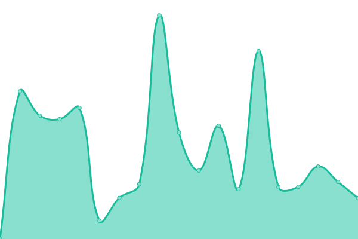

# [📈 Live Status](https://uptime.sulithosting.com): <!--live status--> **🟧 Partial outage**

This repository contains the open-source uptime monitor and status page for [zbtechph](https://uptime.sulithosting.com), powered by [Upptime](https://github.com/upptime/upptime).

With [Upptime](https://upptime.js.org), you can get your own unlimited and free uptime monitor and status page, powered entirely by a GitHub repository. We use [Issues](https://github.com/zbtechph/uptime/issues) as incident reports, [Actions](https://github.com/zbtechph/uptime/actions) as uptime monitors, and [Pages](https://uptime.sulithosting.com) for the status page.

<!--start: status pages-->
<!-- This summary is generated by Upptime (https://github.com/upptime/upptime) -->
<!-- Do not edit this manually, your changes will be overwritten -->
<!-- prettier-ignore -->
| URL | Status | History | Response Time | Uptime |
| --- | ------ | ------- | ------------- | ------ |
|  [Billing Portal](https://billing.sulithosting.com) | 🟩 Up | [billing-portal.yml](https://github.com/zbtechph/uptime/commits/HEAD/history/billing-portal.yml) | 

 750ms
     
 | 

<a href="https://uptime.sulithosting.com/history/billing-portal">88.49%</a>
    

|  WEB-US01 | 🟩 Up | [web-us-01.yml](https://github.com/zbtechph/uptime/commits/HEAD/history/web-us-01.yml) | 

 556ms
     
 | 

<a href="https://uptime.sulithosting.com/history/web-us-01">96.14%</a>
    

|  WEB-US02 | 🟩 Up | [web-us-02.yml](https://github.com/zbtechph/uptime/commits/HEAD/history/web-us-02.yml) | 

 554ms
     
 | 

<a href="https://uptime.sulithosting.com/history/web-us-02">96.54%</a>
    

|  WEB-SG01 | 🟩 Up | [web-sg-01.yml](https://github.com/zbtechph/uptime/commits/HEAD/history/web-sg-01.yml) | 

 851ms
     
 | 

<a href="https://uptime.sulithosting.com/history/web-sg-01">96.92%</a>
    

|  WEB-NL01 | 🟥 Down | [web-nl-01.yml](https://github.com/zbtechph/uptime/commits/HEAD/history/web-nl-01.yml) | 

 681ms
     
 | 

<a href="https://uptime.sulithosting.com/history/web-nl-01">99.86%</a>
    

<!--end: status pages-->

[**Visit our status website →**](https://uptime.sulithosting.com)

## 📄 License

- Powered by: [Upptime](https://github.com/upptime/upptime)
- Code: [MIT](./LICENSE) © [Anand Chowdhary](https://anandchowdhary.com), supported by [Pabio](https://pabio.com)
- Data in the `./history` directory: [Open Database License](https://opendatacommons.org/licenses/odbl/1-0/)
